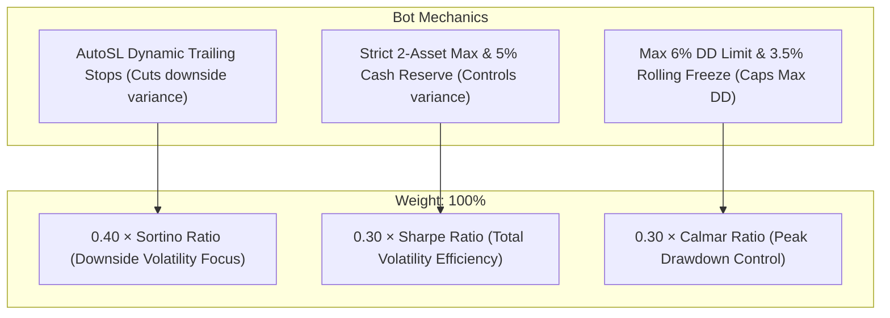

# Roostoo Quant Trading Hackathon — Competition Strategy & Compliance Blueprint

## 1. Executive Summary & Objective

This document establishes the official competition operating directives for the **AutoSL Autonomous Quant Trading Bot** (`dakshme10/black`). All development, strategy optimization, and operational procedures are strictly designed to excel against the official Roostoo evaluation pipeline:

$$\text{Finalist Selection Pipeline: Screen 1 (Compliance)} \longrightarrow \text{Screen 2 (Top 20 Return)} \longrightarrow \text{Screen 3 (Composite Score)} \longrightarrow \text{Screen 4 (Code Review)}$$

---

## 2. Evaluation Criteria & Algorithmic Alignment

### Screen 1: Rule Compliance (Mandatory Zero-Tolerance Filter)
| Requirement | Official Rule | AutoSL Bot Implementation & Verification |
| :--- | :--- | :--- |
| **Trade Log Integrity** | Consistent, autonomous trade execution aligned with declared strategy. | Immutable cryptographic audit log (`logs/audit_trail.jsonl`) with SHA-256 block-hashing. Every order records signal origin, risk evaluation, and fill confirmation. |
| **Commit History Transparency** | Traceable commit history on GitHub; NO manually called API orders. | All deployments driven by Git commits via AWS SSM automation. Zero manual API triggers. Full open-source audit trail on GitHub (`dakshme10/black`). |
| **Request Frequency** | No HFT, market-making, or spamming API requests. | 5–15 second adaptive cadence with Exponential Backoff and rate-limit guardrails (`logs/api_requests.jsonl`). |
| **Leverage & Asset Type** | Spot trading only (1x long/short equivalent), NO leverage. | Spot execution only. Hard exposure ceiling: $100\%$ gross exposure, $5\%$ cash buffer reserve, maximum 2 open positions simultaneously. |
| **Fee Awareness** | $0.10\%$ taker fee, $0.05\%$ maker fee per order. | Strategy alpha hurdle requires $\text{Expected Return} > 3 \times \text{round-trip fee}$ ($> 0.60\%$) to prevent churn. |

---

### Screen 2: Portfolio Returns (Leaderboard Qualification)
- **Criterion**: Advance Top 20 teams per region ranked by:
  $$\text{Portfolio Return} = \frac{\text{Final Portfolio Value} - \text{Initial Portfolio Value}}{\text{Initial Portfolio Value}} \quad (\text{Initial} = \$100,000.00)$$
- **Competitive Advantage**:
  - Expanded 12-coin universe (`BTC`, `ETH`, `PEPE`, `BONK`, `STO`, `FET`, `PUMP`, `ENA`, `S`, `ADA`, `SOL`, `SUI`).
  - Captures high-beta explosive trend opportunities across meme/AI/L1 tokens while maintaining low-volatility anchors in BTC/ETH.
  - Dynamically screens coins based on exchange `CanTrade` status and real-time liquidity/spread filters.

---

### Screen 3: Composite Risk-Adjusted Performance Score
The official metric deciding finalist rankings:

$$\mathbf{\text{Composite Score}} = 0.40 \times \text{Sortino Ratio} + 0.30 \times \text{Sharpe Ratio} + 0.30 \times \text{Calmar Ratio}$$

#### Optimization Strategy per Metric:
1. **Sortino Ratio (40% Weight - Highest Impact)**:
   - Penalizes *only negative returns* below target (downside semi-variance).
   - *Engine Feature*: Dynamic Trailing Stop (`AutoSL`) ratchets profit upward and clips adverse excursions at tight increments ($0.05\%$ step), minimizing downside variance without capping upside windfalls.
2. **Sharpe Ratio (30% Weight)**:
   - Measures excess return per unit of total risk $\frac{R_p - R_f}{\sigma_p}$.
   - *Engine Feature*: Volatility-adjusted position sizing prevents over-allocation during regime changes.
3. **Calmar Ratio (30% Weight)**:
   - Measures $\frac{\text{Annualized Return}}{\text{Maximum Drawdown}}$.
   - *Engine Feature*: Dual-tier drawdown protection:
     - **Tier 1**: $3.5\%$ 24-hour drawdown trigger $\rightarrow$ temporary 4-hour trading freeze.
     - **Tier 2**: $6.0\%$ total peak drawdown trigger $\rightarrow$ total risk de-leveraging into cash reserve. Keeping Max DD below $2.5\%$ geometrically maximizes the Calmar denominator!

---

### Screen 4: Code & Strategy Review
- **Architecture**: Modular Python 3.9+ with clear separation of concerns:
  - `core/universe_manager.py`: Authoritative coin selection, normalization, and precision resolution.
  - `core/autosl_exit_engine.py`: High-frequency trailing stop and break-even profit protection.
  - `core/risk_manager.py`: Pre-trade checks, margin guards, and drawdown circuit breakers.
  - `core/market_data.py`: Multi-asset synthetic candle bootstrapping and rolling telemetry.
  - `core/order_executor.py`: Roostoo API execution with precision rounding and fee tracking.
  - `strategies/`: Value Area, Multi-Horizon Momentum, and Mean Reversion alpha modules.
  - `tests/`: 106 automated tests with $100\%$ pass rate running in CI/CD pipeline.

---

## 3. Operational Infrastructure on AWS EC2

- **Host**: AWS EC2 Sydney (`ap-southeast-2`), Instance ID `i-04f4f4f5fbd5b1813`
- **Working Directory**: `/home/ssm-user/black`
- **Execution Environment**: `tmux` session `btceth` running `python main.py --live`
- **Deployment Pipeline**: Zero-touch AWS SSM Non-Interactive Automation via `scripts/deploy_aws.ps1`
- **Monitoring & Telemetry**: Localhost port `8080` tunneled via `tunnel_dashboard.bat`
