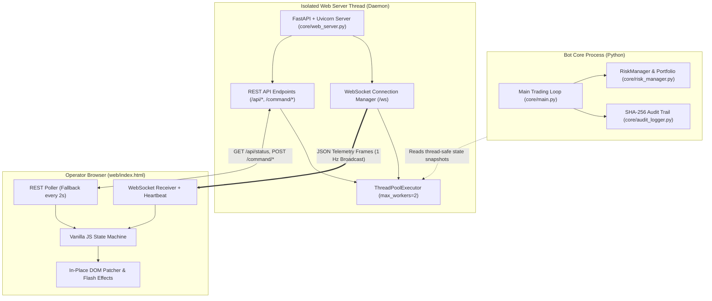

# Engineering Handover: Professional-Grade Institutional Web Telemetry Dashboard

> **Target Audience**: AI Agents, Autonomous Coding Bots, and Full-Stack Quantitative Engineers.  
> **Mission**: This document provides the complete, self-contained architectural blueprint, design tokens, communication protocols, and implementation recipes required to construct a zero-dependency, institutional-grade quantitative trading dashboard matching the caliber of [web/index.html](file:///d:/MKT/BOT%20Experiments/BTCETH/web/index.html) and [core/web_server.py](file:///d:/MKT/BOT%20Experiments/BTCETH/core/web_server.py).

---

## Table of Contents
1. [Core Architectural Philosophy](#1-core-architectural-philosophy)
2. [High-Level System Topology & Concurrency Model](#2-high-level-system-topology--concurrency-model)
3. [Telemetry Protocol & Data Contract Specification](#3-telemetry-protocol--data-contract-specification)
4. [Backend Server Implementation Blueprint](#4-backend-server-implementation-blueprint)
5. [Visual Design System & Aesthetics (Institutional Dark Mode)](#5-visual-design-system--aesthetics-institutional-dark-mode)
6. [Frontend Single-Page Architecture (Zero External Build Tooling)](#6-frontend-single-page-architecture-zero-external-build-tooling)
7. [Quantitative Visualizations & Microstructure Components](#7-quantitative-visualizations--microstructure-components)
8. [Command Dispatch, Operator Safety & Modals](#8-command-dispatch-operator-safety--modals)
9. [DevOps, Docker Packaging & Reverse-Proxy Hardening](#9-devops-docker-packaging--reverse-proxy-hardening)
10. [Automated Test Suite & Verification Checklist](#10-automated-test-suite--verification-checklist)
11. [Step-by-Step Construction Recipe for Another Bot](#11-step-by-step-construction-recipe-for-another-bot)

---

## 1. Core Architectural Philosophy

When building a mission-critical quant bot dashboard, **availability, latency isolation, and operational safety** supersede conventional web application patterns.

```
┌──────────────────────────────────────────────────────────────────────────────────────────┐
│                                 CORE ARCHITECTURAL PILLARS                               │
├──────────────────────────┬─────────────────────────────┬─────────────────────────────────┤
│ 1. ZERO BUILD DEPENDENCY │ 2. ZERO MAIN-THREAD LATENCY │ 3. DUAL-CHANNEL PROTOCOL        │
│ Single self-contained    │ Dashboard data serialization│ Real-time WebSocket streaming   │
│ HTML5/CSS3/Vanilla JS file│ runs in a private thread-   │ with automatic fallback to REST │
│ No npm, webpack, or Vite │ pool executor; bot execution│ polling if the WebSocket drops  │
│ Zero frontend bundle step│ is never delayed by web I/O │ or is blocked by firewalls      │
├──────────────────────────┼─────────────────────────────┼─────────────────────────────────┤
│ 4. IN-PLACE DOM MUTATION │ 5. TWO-TIER SAFETY CONTROLS │ 6. CRYPTOGRAPHIC VERIFICATION   │
│ Price-tick updates avoid │ Destructive actions require │ SHA-256 chained audit logs are  │
│ innerHTML destruction;   │ modal confirmations; orders │ streamed and verified in-client │
│ elements pulse & flash   │ pass through risk filters   │ to prove zero ledger tampering  │
└──────────────────────────┴─────────────────────────────┴─────────────────────────────────┘
```

> [!IMPORTANT]
> **Never stall the trading bot's main loop**. Financial algorithms cannot tolerate garbage collection stalls or blocking JSON serialization caused by dashboard clients. The web server must run in a dedicated background daemon thread and serialize state via an asynchronous `ThreadPoolExecutor`.

---

## 2. High-Level System Topology & Concurrency Model



### Concurrency Rules
1. **Thread Separation**: The `WebServer` initializes an independent `asyncio` event loop on a dedicated Python thread (`Thread(target=_run_server, daemon=True, name="roostoo_web_server")`).
2. **Serialization Isolation**: Snapshot generation (`_prepare_data()`) is delegated to `loop.run_in_executor(self._dash_executor, self._prepare_data)`. If snapshotting takes 15ms, the trading engine's 2-second market loop experiences 0.00ms delay.
3. **Connection Pruning**: Dead or unresponsive WebSocket connections are removed under an `asyncio.Lock()` to prevent memory leaks and slow broadcasts.

---

## 3. Telemetry Protocol & Data Contract Specification

The WebSocket broadcast (`/ws`) and the HTTP status endpoint (`GET /api/status`) emit identical JSON payloads. Any bot replicating this dashboard must adhere to this unified contract.

### Complete Telemetry JSON Contract

```json
{
  "server_time": "2026-09-25 06:15:00 UTC",
  "status": {
    "is_running": true,
    "paused": false,
    "mode": "LIVE",
    "dry_run": false,
    "live_trading_enabled": true,
    "last_market_update": "2026-09-25T06:14:58Z",
    "last_api_request": "2026-09-25T06:14:59Z",
    "active_strategy": "MULTI_ENGINE",
    "last_signal": "BUY BTC/USD (Confidence 85%)",
    "last_order": "ORD-20260925-001 FILLED",
    "last_error": null
  },
  "portfolio": {
    "equity": 104520.50,
    "cash": 45200.00,
    "available_cash": 40200.00,
    "min_cash_reserve": 5000.00,
    "cash_reserve_pct": 5.0,
    "gross_exposure_pct": 56.75,
    "gross_exposure_limit": 100.0,
    "realized_pnl": 3120.50,
    "unrealized_pnl": 1400.00,
    "total_pnl": 4520.50,
    "peak_equity": 105100.00,
    "current_drawdown_pct": 0.55,
    "max_drawdown_limit": 6.0,
    "rolling_24h_drawdown_pct": 1.20,
    "rolling_24h_drawdown_limit": 3.5,
    "is_frozen": false,
    "permanent_kill": false,
    "open_position_count": 2,
    "max_positions": 2
  },
  "competition": {
    "composite_score": 1.8420,
    "sortino_ratio": 2.45,
    "sharpe_ratio": 1.80,
    "calmar_ratio": 3.10,
    "total_return_pct": 4.52,
    "max_drawdown_pct": 0.95
  },
  "positions": [
    {
      "symbol": "BTC/USD",
      "base_coin": "BTC",
      "quantity": 0.75,
      "entry_price": 82000.00,
      "current_price": 83200.00,
      "notional_value": 62400.00,
      "unrealized_pnl": 900.00,
      "unrealized_pnl_pct": 1.46,
      "realized_pnl": 450.00,
      "strategy": "VALUE_AREA",
      "stop_loss": 80500.00,
      "take_profit_1": 84500.00,
      "take_profit_2": 87000.00,
      "opened_timestamp": 1758780900000,
      "highest_price": 83450.00,
      "trailing_status": "+1.0R Breakeven Locked"
    }
  ],
  "tracking": [
    {
      "symbol": "BTC/USD",
      "ticker": {
        "last_price": 83200.00,
        "bid": 83195.00,
        "ask": 83205.00,
        "spread": 10.00,
        "spread_bps": 1.2,
        "change_24h_pct": 2.45,
        "volume_24h": 12540.5
      },
      "regime": {
        "name": "TREND",
        "trend_direction": "BULLISH",
        "adx": 32.4,
        "atr": 1420.50,
        "volatility_percentile": 68.5
      },
      "value_area": {
        "signal": "BUY",
        "confidence": 0.85,
        "vah": 84100.00,
        "poc": 82800.00,
        "val": 81500.00,
        "session_vwap": 82650.00,
        "position_desc": "Above POC, Inside Value Area"
      },
      "liquidity_sweep": {
        "signal": "NO_TRADE",
        "confidence": 0.0,
        "swing_high": 84500.00,
        "swing_low": 80900.00,
        "displacement": false,
        "fvg_present": true
      },
      "cvd_absorption": {
        "signal": "BUY",
        "confidence": 0.70,
        "delta_volume": 45.2,
        "cvd_value": 312.4,
        "degraded_mode": false
      },
      "chosen_signal": {
        "direction": "BUY",
        "strategy": "VALUE_AREA",
        "confidence": 0.85,
        "reason": "Mean reversion reclaim above VAL with positive delta",
        "stop_loss": 80500.00,
        "take_profit_1": 84500.00,
        "take_profit_2": 87000.00,
        "expected_rr": 2.40
      }
    }
  ],
  "ticks": [
    {
      "timestamp": "06:14:58",
      "symbol": "BTC/USD",
      "last_price": 83200.00,
      "shift": 25.00,
      "max_bid": 83195.00,
      "min_ask": 83205.00,
      "spread": 10.00,
      "spread_bps": 1.2,
      "volume": 12540.5,
      "source": "ROOSTOO_POLL"
    }
  ],
  "orders": [
    {
      "client_order_id": "ORD-20260925-001",
      "create_timestamp": 1758780900000,
      "symbol": "BTC/USD",
      "side": "BUY",
      "order_type": "LIMIT",
      "price": 82000.00,
      "filled_avg_price": 82000.00,
      "quantity": 0.75,
      "filled_quantity": 0.75,
      "status": "FILLED",
      "commission": 41.00,
      "strategy": "VALUE_AREA"
    }
  ],
  "audit": {
    "verified": true,
    "message": "SHA-256 chain fully verified (148 records)",
    "total_records": 148,
    "records": [
      {
        "sequence_id": 148,
        "timestamp_iso": "2026-09-25T06:14:58Z",
        "event_type": "ORDER_SUBMITTED",
        "details": "Submitted LIMIT BUY 0.75 BTC/USD @ 82000.00",
        "current_hash": "a4f891b2c3d4e5f6...",
        "previous_hash": "9c12348a7b6e5d0f..."
      }
    ]
  },
  "rate_limiter": {
    "tokens": 9.5,
    "drift_ms": -12.0
  },
  "equity_curve": [
    { "timestamp": 1758777300000, "equity": 100000.0, "cash": 100000.0, "gross_exposure": 0.0 },
    { "timestamp": 1758780900000, "equity": 104520.5, "cash": 45200.0, "gross_exposure": 59320.5 }
  ]
}
```

---

## 4. Backend Server Implementation Blueprint

Below is the production-tested pattern from [core/web_server.py](file:///d:/MKT/BOT%20Experiments/BTCETH/core/web_server.py). When deploying in another bot, copy this pattern directly.

```python
import asyncio
import os
import uvicorn
from concurrent.futures import ThreadPoolExecutor
from threading import Thread
from typing import Any, Dict, List, Optional
from fastapi import FastAPI, HTTPException, Request, WebSocket, WebSocketDisconnect
from fastapi.responses import HTMLResponse, JSONResponse
from starlette.middleware.base import BaseHTTPMiddleware

_WEB_DIR = os.path.join(os.path.dirname(os.path.abspath(__file__)), "web")

class _AuthGate(BaseHTTPMiddleware):
    def __init__(self, app, token: str):
        super().__init__(app)
        self._token = token

    async def dispatch(self, request: Request, call_next):
        if not self._token or request.url.path in ("/api/ping", "/api/health"):
            return await call_next(request)
        supplied = request.query_params.get("token", "")
        auth = request.headers.get("authorization", "")
        if auth.lower().startswith("bearer "):
            supplied = auth[7:].strip()
        if supplied == self._token:
            return await call_next(request)
        if request.url.path.startswith("/api/"):
            return JSONResponse(status_code=401, content={"error": "Unauthorized"})
        return HTMLResponse(content="<h2>Access Denied: Enter Token</h2>", status_code=401)

class WebServer:
    def __init__(self, bot, host: str = "0.0.0.0", port: int = 8080, auth_token: str = ""):
        self.bot = bot
        self.host = host
        self.port = port
        self.auth_token = auth_token
        self.app = FastAPI(title="Quant Bot Telemetry")
        self.active_connections: List[WebSocket] = []
        self._ws_lock = asyncio.Lock()
        self._dash_executor = ThreadPoolExecutor(max_workers=2, thread_name_prefix="quant_dash")
        self._last_payload: Optional[Dict[str, Any]] = None
        self.stop_event = asyncio.Event()
        self._server_thread: Optional[Thread] = None

        if self.auth_token:
            self.app.add_middleware(_AuthGate, token=self.auth_token)

        self._setup_routes()

    def _setup_routes(self):
        @self.app.get("/")
        async def index():
            path = os.path.join(_WEB_DIR, "index.html")
            with open(path, "r", encoding="utf-8") as f:
                return HTMLResponse(f.read())

        @self.app.get("/api/status")
        async def get_status():
            loop = asyncio.get_running_loop()
            data = await loop.run_in_executor(self._dash_executor, self._prepare_data)
            return JSONResponse(data)

        @self.app.post("/command/{cmd}")
        async def handle_command(cmd: str, payload: Optional[Dict[str, Any]] = None):
            if cmd == "pause":
                return {"status": "success", "message": f"Paused: {self.bot.toggle_pause()}"}
            elif cmd == "kill":
                return {"status": "success", "details": self.bot.handle_kill_switch()}
            elif cmd == "reconcile":
                return {"status": "success", "details": self.bot.handle_reconcile()}
            elif cmd == "reset_risk":
                return {"status": "success", "details": self.bot.handle_reset_risk()}
            raise HTTPException(status_code=400, detail=f"Unknown command {cmd}")

        @self.app.websocket("/ws")
        async def ws_endpoint(websocket: WebSocket):
            await websocket.accept()
            async with self._ws_lock:
                self.active_connections.append(websocket)
            try:
                # Immediate initial state burst
                data = self._last_payload or self._prepare_data()
                await websocket.send_json(data)
                while True:
                    await websocket.receive_text()  # Keep-alive listener
            except WebSocketDisconnect:
                pass
            finally:
                async with self._ws_lock:
                    if websocket in self.active_connections:
                        self.active_connections.remove(websocket)

    def _prepare_data(self) -> Dict[str, Any]:
        # Extract thread-safe read-only snapshot of bot metrics
        return { ... }

    async def _broadcast_loop(self):
        loop = asyncio.get_running_loop()
        while not self.stop_event.is_set():
            async with self._ws_lock:
                conns = list(self.active_connections)
            if conns:
                data = await loop.run_in_executor(self._dash_executor, self._prepare_data)
                self._last_payload = data
                dead = []
                for ws in conns:
                    try:
                        await ws.send_json(data)
                    except Exception:
                        dead.append(ws)
                if dead:
                    async with self._ws_lock:
                        for d in dead:
                            if d in self.active_connections:
                                self.active_connections.remove(d)
            await asyncio.sleep(1.0)

    def start(self):
        def _run():
            self._loop = asyncio.new_event_loop()
            asyncio.set_event_loop(self._loop)
            self._loop.create_task(self._broadcast_loop())
            cfg = uvicorn.Config(app=self.app, host=self.host, port=self.port, log_level="warning")
            server = uvicorn.Server(cfg)
            self._loop.run_until_complete(server.serve())

        self._server_thread = Thread(target=_run, daemon=True, name="quant_dash_thread")
        self._server_thread.start()

    def stop(self):
        self.stop_event.set()
        self._dash_executor.shutdown(wait=False)
```

---

## 5. Visual Design System & Aesthetics (Institutional Dark Mode)

The UI uses a curated dark color palette inspired by Bloomberg Terminal and modern trading stations.

### Color Tokens (CSS Custom Properties)

```css
:root {
    /* Surfaces */
    --bg-base:        #060911; /* Deepest void black */
    --bg-card:        #0b111e; /* Elevated panel surface */
    --bg-card-hover:  #101828; /* Hover highlight */
    --bg-card-alt:    #0e1524; /* Subtle inset contrast */
    --bg-header:      #0d1322; /* Structural frame */

    /* Borders */
    --border:         #1a2438; /* Crisp 1px division */
    --border-hover:   #263552; /* Active/Hover border */
    --border-bright:  #334466; /* Modal/Focus highlight */

    /* Typography */
    --text-main:      #f1f5f9; /* Slate 100 - Primary readable */
    --text-muted:     #94a3b8; /* Slate 400 - Secondary info */
    --text-dim:       #64748b; /* Slate 500 - Structural labels */

    /* Functional Accents */
    --accent:         #38bdf8; /* Cyan Sky - Microstructure & Links */
    --accent-hover:   #0284c7;
    --accent-glow:    rgba(56, 189, 248, 0.15);

    --positive:       #10b981; /* Emerald - Profit / Long / Health */
    --positive-glow:  rgba(16, 185, 129, 0.18);

    --negative:       #f43f5e; /* Rose Red - Loss / Danger / Kill */
    --negative-glow:  rgba(244, 63, 94, 0.18);

    --warning:        #f59e0b; /* Amber - Drawdown Caution / Freeze */
    --warning-glow:   rgba(245, 158, 11, 0.18);

    --purple:         #a855f7; /* Violet - Quant Regimes / ML */
    --purple-glow:    rgba(168, 85, 247, 0.18);
}
```

### Typography System
- **UI Elements & Text**: `'Inter', -apple-system, BlinkMacSystemFont, sans-serif`
- **Numerical Data & Hashes**: `'JetBrains Mono', monospace` (`.mono` class)

### Essential Micro-Animations

```css
/* Live pulsing dot indicator */
.dot-pulse {
    width: 7px;
    height: 7px;
    border-radius: 50%;
    background: #10b981;
    box-shadow: 0 0 8px #10b981;
    animation: pulse 1.8s infinite;
}
@keyframes pulse {
    0% { transform: scale(0.9); opacity: 0.7; }
    50% { transform: scale(1.2); opacity: 1; }
    100% { transform: scale(0.9); opacity: 0.7; }
}

/* Price tick change flashes */
@keyframes flashGreen {
    0% { background-color: rgba(16, 185, 129, 0.45); color: #fff; text-shadow: 0 0 10px #10b981; }
    100% { background-color: transparent; }
}
@keyframes flashRed {
    0% { background-color: rgba(244, 63, 94, 0.45); color: #fff; text-shadow: 0 0 10px #f43f5e; }
    100% { background-color: transparent; }
}
.flash-up   { animation: flashGreen 0.8s ease-out; }
.flash-down { animation: flashRed 0.8s ease-out; }
```

---

## 6. Frontend Single-Page Architecture (Zero External Build Tooling)

The UI file `web/index.html` is completely standalone. It contains HTML, embedded CSS, and client-side JavaScript.

### Client-Side State Machine & Reconnect Loop

```javascript
let ws = null;
let wsReconnectTimer = null;
let totalTicksReceived = 0;
let lastFrameTime = Date.now();
let lastKnownPrices = {};

function connectWebSocket() {
    const protocol = location.protocol === 'https:' ? 'wss:' : 'ws:';
    const wsUrl = `${protocol}//${location.host}/ws`;

    ws = new WebSocket(wsUrl);

    ws.onopen = () => {
        document.getElementById('ws-status').innerText = 'WS: CONNECTED';
        document.getElementById('ws-pulse').style.background = '#10b981';
    };

    ws.onmessage = (event) => {
        try {
            const data = JSON.parse(event.data);
            totalTicksReceived++;
            lastFrameTime = Date.now();
            renderTelemetry(data);
        } catch (e) {
            console.error('Frame decode error:', e);
        }
    };

    ws.onclose = () => {
        document.getElementById('ws-status').innerText = 'WS: RECONNECTING...';
        document.getElementById('ws-pulse').style.background = '#f59e0b';
        clearTimeout(wsReconnectTimer);
        wsReconnectTimer = setTimeout(connectWebSocket, 2000);
    };

    ws.onerror = (err) => {
        console.error('WS Error:', err);
        ws.close();
    };
}

// Fallback HTTP Poller (Runs every 2s if WebSocket drops)
setInterval(async () => {
    if (!ws || ws.readyState !== WebSocket.OPEN) {
        try {
            const res = await fetch('/api/status');
            if (res.ok) {
                const data = await res.json();
                renderTelemetry(data);
            }
        } catch (e) {}
    }
}, 2000);

// Heartbeat indicator updating every 100ms
setInterval(() => {
    const elapsed = ((Date.now() - lastFrameTime) / 1000).toFixed(1);
    const el = document.getElementById('stream-elapsed');
    if (el) el.innerText = `${elapsed}s ago`;
}, 100);
```

### In-Place DOM Mutation Pattern (No innerHTML destruction)

```javascript
function updatePriceElement(id, currentPrice) {
    const el = document.getElementById(id);
    if (!el) return;
    const prev = parseFloat(el.dataset.lastPrice || '0');
    if (prev > 0) {
        if (currentPrice > prev) {
            el.classList.remove('flash-up', 'flash-down');
            void el.offsetWidth; // Force CSS reflow
            el.classList.add('flash-up');
        } else if (currentPrice < prev) {
            el.classList.remove('flash-up', 'flash-down');
            void el.offsetWidth;
            el.classList.add('flash-down');
        }
    }
    el.dataset.lastPrice = currentPrice;
    el.innerText = `$${currentPrice.toLocaleString('en-US', { minimumFractionDigits: 2 })}`;
}
```

---

## 7. Quantitative Visualizations & Microstructure Components

The dashboard visualizes advanced microstructure and quantitative execution signals:

### 1. Volume Profile / Value Area 1D Track
Displays the 70% Value Area (VAL to VAH), Point of Control (POC), and current spot price pin on a normalized horizontal bar.

```
       [-------------- 70% Value Area Range --------------]
|------[======================|===========================]------|
Min   VAL                    POC                         VAH   Max
                               ▲
                       [ Glowing Price Pin ]
```

```javascript
// Mathematics to compute position percentage:
const spreadRange = Math.max(1, (vah - val) * 2.2);
const centerVal = (vah + val) / 2;
const minRange = centerVal - spreadRange / 2;
const maxRange = centerVal + spreadRange / 2;

const getPct = (px) => Math.min(100, Math.max(0, ((px - minRange) / spreadRange) * 100));

const valLeftPct = getPct(val);
const vahRightPct = getPct(vah);
const vaWidthPct = Math.max(4, vahRightPct - valLeftPct);
const pocPct = getPct(poc);
const currentPxPct = getPct(lastPrice);

// Apply directly to DOM:
document.getElementById('va-fill').style.left = `${valLeftPct}%`;
document.getElementById('va-fill').style.width = `${vaWidthPct}%`;
document.getElementById('va-poc').style.left = `${pocPct}%`;
document.getElementById('va-pin').style.left = `${currentPxPct}%`;
```

### 2. Live Order Flow & Tick Tape (Memory-Bounded)
Maintains a rolling buffer of market ticks. Limits total entries to 40 rows to avoid browser DOM degradation:

```javascript
const maxTapeRows = 40;
let tickTapeBuffer = [];

function updateTickTape(incomingTicks) {
    incomingTicks.forEach(t => tickTapeBuffer.unshift(t));
    if (tickTapeBuffer.length > maxTapeRows) {
        tickTapeBuffer = tickTapeBuffer.slice(0, maxTapeRows);
    }
    // Render table rows with directional flash classes
}
```

---

## 8. Command Dispatch, Operator Safety & Modals

All manual operator actions adhere to a strict safety model:

| Command | Route | Safety Filter | Behavior |
| :--- | :--- | :--- | :--- |
| **Pause / Resume** | `POST /command/pause` | State toggle | Suspends strategy evaluation without closing open positions. |
| **Emergency Kill Switch** | `POST /command/kill` | Modal Confirmation | Liquidates ALL open positions to cash, cancels all open limit orders, trips permanent risk breaker. |
| **Exchange Reconciliation** | `POST /command/reconcile` | Direct sync | Polls Roostoo exchange balances & orders; synchronizes internal portfolio ledger. |
| **Reset Risk Breaker** | `POST /command/reset_risk` | Drawdown check | Resets temporary 6-hour freeze if drawdown has recovered above the 3.5% threshold. |
| **De-Risk Position** | `POST /command/derisk` | Confirmation prompt | Market-sells target symbol (or all symbols) directly to cash. |

```javascript
async function sendCommand(cmd, payload = {}) {
    try {
        const res = await fetch(`/command/${cmd}`, {
            method: 'POST',
            headers: { 'Content-Type': 'application/json' },
            body: JSON.stringify(payload)
        });
        const data = await res.json();
        showToast(data.message || `Command ${cmd} executed`);
        return data;
    } catch (err) {
        showToast(`Request failed: ${err.message}`);
    }
}
```

---

## 9. DevOps, Docker Packaging & Reverse-Proxy Hardening

### Common Production Bug: Docker Static Directory Omission
A frequent bug when containerizing a Python dashboard is copying `core/` and `config/` but omitting `web/`.

```dockerfile
# Dockerfile snippet: Ensure web assets are explicitly copied
COPY --chown=appuser:appgroup config/ ./config/
COPY --chown=appuser:appgroup core/ ./core/
COPY --chown=appuser:appgroup state/ ./state/
COPY --chown=appuser:appgroup web/ ./web/   # <--- CRITICAL: Must be copied!
```

### Production Nginx Reverse Proxy Configuration
When hosting behind Nginx, WebSocket upgrade headers are required:

```nginx
server {
    listen 80;
    server_name trading.yourdomain.com;

    location / {
        proxy_pass http://127.0.0.1:8080;
        proxy_http_version 1.1;

        # WebSocket support
        proxy_set_header Upgrade $http_upgrade;
        proxy_set_header Connection "upgrade";

        # Standard headers
        proxy_set_header Host $host;
        proxy_set_header X-Real-IP $remote_addr;
        proxy_set_header X-Forwarded-For $proxy_add_x_forwarded_for;
        proxy_read_timeout 3600s;
        proxy_send_timeout 3600s;
    }
}
```

---

## 10. Automated Test Suite & Verification Checklist

Every implementation must include end-to-end unit tests using `pytest` and `fastapi.testclient.TestClient`. Refer to [tests/test_web_server.py](file:///d:/MKT/BOT%20Experiments/BTCETH/tests/test_web_server.py).

```python
def test_websocket_telemetry_stream(mock_bot):
    server = WebServer(mock_bot, port=8080)
    client = TestClient(server.app)

    with client.websocket_connect("/ws") as websocket:
        data = websocket.receive_json()
        assert "portfolio" in data
        assert "competition" in data
        assert "tracking" in data
        assert "audit" in data
        assert data["portfolio"]["equity"] == 100000.0

def test_command_pause_and_resume(mock_bot):
    server = WebServer(mock_bot, port=8080)
    client = TestClient(server.app)

    res = client.post("/command/pause")
    assert res.status_code == 200
    assert mock_bot.paused is True
```

---

## 11. Step-by-Step Construction Recipe for Another Bot

When delegating the creation of this dashboard to another bot, instruct the bot to execute these 5 sequential phases:

```
┌─────────────────────────────────────────────────────────────────────────────┐
│                       5-PHASE DASHBOARD EXECUTION RECIPE                    │
├─────────────────────────────────────────────────────────────────────────────┤
│ PHASE 1: Implement `core/web_server.py` with FastAPI, Uvicorn, and          │
│          ThreadPoolExecutor snapshot isolation.                             │
│                                                                             │
│ PHASE 2: Define the `_prepare_data()` snapshot generator matching the JSON  │
│          telemetry contract (equity, drawdown, regime, strategy signals).   │
│                                                                             │
│ PHASE 3: Write `web/index.html` with institutional dark mode tokens,        │
│          5 KPI cards, tabs, and real-time Value Area range bars.            │
│                                                                             │
│ PHASE 4: Implement WebSocket client with 100ms heartbeat counter, in-place  │
│          DOM price flashers, and 2s HTTP polling fallback.                  │
│                                                                             │
│ PHASE 5: Write unit test suite (`test_web_server.py`) covering all routes, │
│          WS handshake, and verify `COPY web/ ./web/` in Dockerfile.         │
└─────────────────────────────────────────────────────────────────────────────┘
```

> [!TIP]
> **Recommended Prompt for Another Bot**:
> *"Construct an institutional-grade quantitative telemetry web dashboard for our trading bot following the architecture and schemas detailed in `HANOVER.MD`. Ensure zero-dependency single-file frontend, thread-isolated FastAPI WebSocket streaming, in-place DOM updates with price flashes, and full safety controls."*

---
*Created for the Roostoo Autonomous Spot Trading System. Document maintained for cross-bot engineering handovers.*
