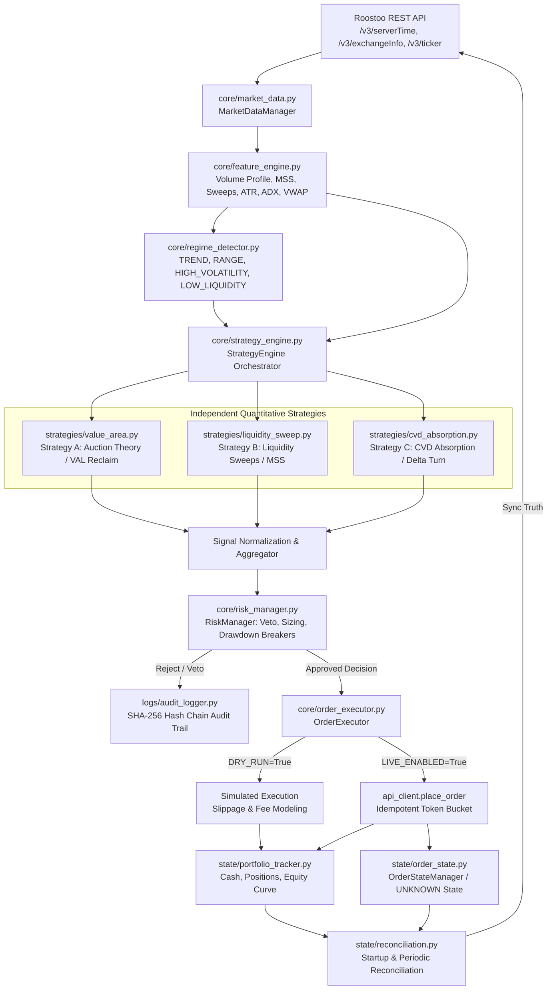

# ROOSTOO HACKATHON — PRODUCTION AUTONOMOUS QUANT TRADING BOT

[](https://www.python.org/downloads/)
[](https://www.docker.com/)
[](https://opensource.org/licenses/MIT)
[-brightgreen.svg)]()
[]()

A production-grade, fully autonomous quantitative spot-trading bot engineered for the **Roostoo Hackathon Mock Exchange** (`https://mock-api.roostoo.com`).

The system optimizes for the official competition Composite Score:
$$\mathbf{\text{Composite Score} = 0.40 \times \text{Sortino} + 0.30 \times \text{Sharpe} + 0.30 \times \text{Calmar}}$$

---

## Architecture Overview



---

## Key Engineering Highlights

1. **Zero Human Intervention**: Fully autonomous decision pipeline from tick polling to order execution and state reconciliation.
2. **Authoritative Exchange State**: Local accounting ledgers continuously reconciled against official Roostoo exchange state (`/v3/balance`, `/v3/query_order`, `/v3/pending_count`).
3. **Multi-Regime Strategy Engine**:
   - **Strategy A (Value Area / Auction Market Theory)**: VAL failed-auction reclaims (Long) and VAH rejection spot de-risking.
   - **Strategy B (Liquidity Sweep + MSS)**: Structural stop sweeps, displacement expansion ($Body > 1.2 \times ATR$), Fair Value Gap (FVG) retests, and Market Structure Shifts.
   - **Strategy C (CVD / OI Absorption)**: Selling absorption and delta reversals. Strictly obeys **Principle 3 (No Hallucinated Data)** by safely degrading when exchange lacks OI/CVD without data fabrication.
4. **Veto-Armed Risk Management**:
   - Dynamic position sizing: $\text{Quantity} = \frac{\text{Equity} \times \text{Risk \%}}{|\text{Entry} - \text{Stop}|}$ (strictly $\le 1.0\%$ default).
   - Mandatory $5.0\%$ cash reserve cushion.
   - Strict $100\%$ gross exposure ceiling (no leverage, no borrowing, no naked shorting).
   - **Rolling 24-hour Drawdown Breaker (3.5%)**: Freezes new entries for 6 hours; liquidates open positions to cash.
   - **Maximum Peak-to-Trough Drawdown Breaker (6.0%)**: Liquidates all holdings to cash and permanently halts new trading.
   - **Stateful Trailing Stop Engine**: Hard stop at entry $\rightarrow$ Breakeven at $+1.0R$ $\rightarrow$ Trailing ATR stop at $+2.0R$ (ratchet only).
5. **Robust Execution & Network Resilience**:
   - Token-bucket rate limiter ($5.0$ req/sec, burst capacity $10$).
   - Exponential backoff with jitter on HTTP 429 and 5xx errors.
   - Client order ID tracking (`client_order_id`) preventing duplicate orders.
   - `UNKNOWN` order state handling on network timeouts with automatic status reconciliation.
6. **Cryptographic Audit Trail**: Every decision, order, fill, and reconciliation recorded in append-only JSON Lines with SHA-256 cryptographic hash-chaining (`seq`, `prev_hash`, `curr_hash`).

---

## Repository Structure

```text
roostoo-bot/
├── config/
│   ├── config.yaml               # User-configurable parameters
│   └── trading_params.py         # Strongly-typed configuration dataclasses
├── core/
│   ├── api_client.py             # Roostoo REST API client, HMAC, token bucket
│   ├── market_data.py            # Candle synthesis (1m, 5m, 15m), stale detection
│   ├── feature_engine.py         # Volume Profile, MSS, Sweeps, FVGs, ATR, ADX
│   ├── regime_detector.py        # Microstructure classification (TREND, RANGE, etc.)
│   ├── strategy_engine.py        # Strategy coordinator & signal aggregation
│   ├── risk_manager.py           # Position sizing, veto power, drawdown breakers
│   ├── order_executor.py         # DRY_RUN simulation & LIVE execution
│   └── performance.py            # Official Composite Score, Sharpe, Sortino, Calmar
├── strategies/
│   ├── value_area.py             # Strategy A: VAL reclaim & VAH de-risking
│   ├── liquidity_sweep.py        # Strategy B: Stop sweeps, MSS, displacement
│   └── cvd_absorption.py         # Strategy C: CVD / Delta absorption & degradation
├── state/
│   ├── portfolio_tracker.py      # Balances, exposure, unrealized/realized PnL, equity
│   ├── order_state.py            # Order lifecycle state machine, UNKNOWN handling
│   └── reconciliation.py         # Exchange truth synchronization
├── backtest/
│   ├── engine.py                 # Zero-lookahead event-driven backtesting engine
│   ├── execution_model.py        # Realistic maker/taker fees and slippage modeling
│   └── walk_forward.py           # In-sample, validation, out-of-sample partitioning
├── logs/
│   └── audit_logger.py           # Append-only structured JSON with SHA-256 chaining
├── tests/                        # 100% automated pytest coverage (28 tests)
│   ├── test_risk.py
│   ├── test_strategies.py
│   ├── test_execution.py
│   ├── test_reconciliation.py
│   ├── test_metrics.py
│   ├── test_backtest.py
│   └── test_market_data.py
├── docs/                         # In-depth architectural & operational manuals
│   ├── ARCHITECTURE.md           # System architecture and data flow
│   ├── STRATEGY_SPEC.md          # Strategy entries, exits, stops, R:R
│   ├── RISK_SPEC.md              # Risk sizing equations & circuit breakers
│   ├── BACKTEST_REPORT.md        # Walk-forward analysis & sensitivity results
│   ├── DEPLOYMENT_GUIDE.md       # AWS EC2 & Docker setup guide
│   ├── OPERATIONS_GUIDE.md       # Runbook, telemetry, emergency stop
│   └── COMPLIANCE_CHECKLIST.md   # Certification against competition rules
├── Dockerfile                    # Production containerization (non-root appuser)
├── docker-compose.yml            # Container orchestration with health check
├── requirements.txt              # Strict runtime dependencies
├── .env.example                  # Template configuration secrets
├── .gitignore                    # Secrets & transient data exclusion
└── main.py                       # Autonomous production orchestrator
```

---

## Quick Start Guide

### One-Click Windows Launch (Recommended)

For Windows users, the easiest way to start and stop the bot is using the provided clickable scripts:

| Script | Action |
|--------|--------|
| **`start_bot.bat`** | Double-click to launch the bot in a new console window and **automatically open the web dashboard** at `http://localhost:8080` |
| **`stop_bot.bat`** | Double-click to **gracefully shut down** the bot (preserves state, audit trail, portfolio) |
| **`restart_bot.bat`** | Double-click to gracefully stop and then restart the bot |

> **Note:** These scripts auto-detect Python (virtual environment or system PATH), handle PID tracking, and require no terminal commands.

---

### 1. Local Setup

Clone the repository and install dependencies in a Python 3.11 virtual environment:

```bash
git clone <REPO_URL> roostoo-bot
cd roostoo-bot

python -m venv venv
source venv/bin/activate  # On Windows: venv\Scripts\activate
pip install -r requirements.txt
```

### 2. Configure Environment

Copy `.env.example` to `.env` and set your Roostoo credentials:

```bash
cp .env.example .env
```

```ini
ROOSTOO_API_KEY="your_api_key"
ROOSTOO_SECRET_KEY="your_secret_key"
ROOSTOO_BASE_URL="https://mock-api.roostoo.com"

# Execution Mode
DRY_RUN=true
LIVE_TRADING_ENABLED=false
```

### 3. Run Automated Tests

Execute the comprehensive test suite (28 unit tests covering risk, execution, strategies, reconciliation, and metrics):

```bash
pytest tests/ -v
```

### 4. Run Historical Backtest & Walk-Forward Validation

Run the reproducible event-driven backtesting engine:

```bash
python main.py --backtest
```

### 5. Check Live Status & Connectivity

Run a single-shot status cycle against the live Roostoo mock exchange:

```bash
python main.py --status
```

### 6. Run Continuous Autonomous Trading (DRY_RUN Mode)

```bash
python main.py --dry-run
```

### 7. Run Live Autonomous Trading (Requires Verified Safety Gate)

To enable live trading on the Roostoo mock exchange:
1. In `.env`, set `DRY_RUN=false` and `LIVE_TRADING_ENABLED=true`.
2. Execute:
```bash
python main.py --live
```

---

## Docker & AWS EC2 Deployment

### 1. Build and Run via Docker Compose

```bash
# Build production Docker image
docker compose build

# Start container in detached background mode
docker compose up -d

# View live container logs & dashboard
docker compose logs -f roostoo-bot
```

### 2. Verify Cryptographic Audit Trail Integrity

```bash
docker compose exec roostoo-bot python -c "
from logs.audit_logger import AuditLogger
valid, msg, count = AuditLogger().verify_integrity()
print(f'Audit Integrity: {valid} | {msg} | Records: {count}')
"
```

For complete cloud deployment instructions, consult the [Deployment Guide](docs/DEPLOYMENT_GUIDE.md).

---

## Official Documentation Deliverables

Detailed technical specifications are available in the `docs/` directory:
- [System Architecture Specification](docs/ARCHITECTURE.md)
- [Quantitative Strategy Specification](docs/STRATEGY_SPEC.md)
- [Risk Management & Circuit Breakers Specification](docs/RISK_SPEC.md)
- [Backtest & Walk-Forward Validation Report](docs/BACKTEST_REPORT.md)
- [AWS EC2 & Docker Deployment Guide](docs/DEPLOYMENT_GUIDE.md)
- [Production Operations & Emergency Runbook](docs/OPERATIONS_GUIDE.md)
- [Competition Compliance Certification Checklist](docs/COMPLIANCE_CHECKLIST.md)

---

## License

This project is licensed under the MIT License - see the LICENSE file for details. All implementations are original quantitative code designed specifically for the Roostoo Hackathon.
