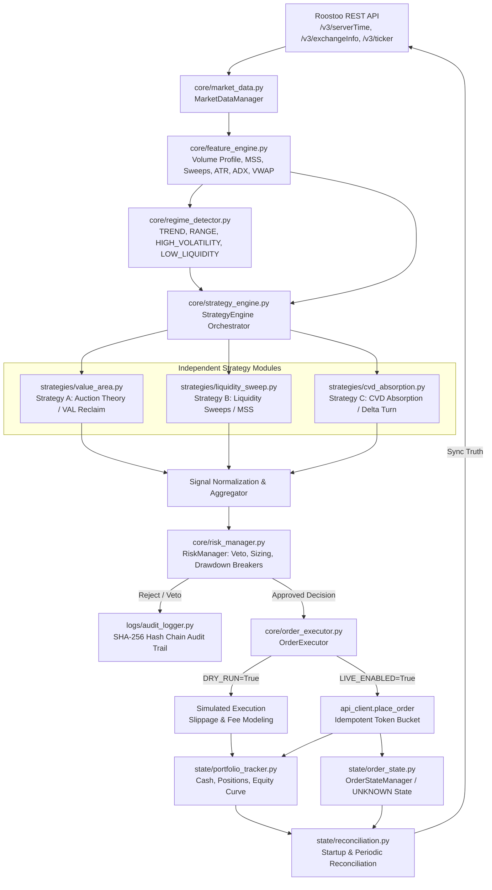

# ROOSTOO QUANT BOT — SYSTEM ARCHITECTURE SPECIFICATION

## 1. Executive Architecture Overview

The **Roostoo Autonomous Quant Trading Bot** is an institutional-grade, medium-frequency algorithmic spot-trading system designed for the official Roostoo Hackathon mock exchange. The architecture guarantees:

1. **Zero Human Intervention**: Fully autonomous lifecycle from market tick ingestion to order execution and state reconciliation.
2. **Authoritative Exchange Truth**: Local accounting ledgers continuously reconciled against official Roostoo exchange state (`/v3/balance`, `/v3/query_order`, `/v3/pending_count`).
3. **Multi-Regime Quantitative Execution**: Three quantitative strategies routed dynamically via statistical regime classification.
4. **Veto-Armed Risk Management**: Strict 1.0% trade risk, 5.0% cash reserve, 100% gross exposure limits, 3.5% rolling 24h drawdown freeze, and 6.0% maximum drawdown permanent circuit breaker.
5. **Cryptographic Auditability**: Every decision, order, API interaction, and state change logged in append-only JSON Lines with SHA-256 hash chaining.



---

## 2. Directory Structure & Modular Separation

The repository is structured into isolated, testable, single-responsibility domains:

```text
roostoo-bot/
│
├── config/
│   ├── config.yaml               # User-configurable parameters
│   └── trading_params.py         # Strongly-typed configuration dataclasses
│
├── core/
│   ├── api_client.py             # Roostoo REST API client, HMAC, token bucket
│   ├── market_data.py            # Candle synthesis (1m, 5m, 15m), stale detection
│   ├── feature_engine.py         # Volume Profile, MSS, Sweeps, FVGs, ATR, ADX
│   ├── regime_detector.py        # Microstructure classification (TREND, RANGE, etc.)
│   ├── strategy_engine.py        # Strategy coordinator & signal aggregation
│   ├── risk_manager.py           # Position sizing, veto power, drawdown breakers
│   ├── order_executor.py         # DRY_RUN simulation & LIVE execution
│   └── performance.py            # Official Composite Score, Sharpe, Sortino, Calmar
│
├── strategies/
│   ├── value_area.py             # Strategy A: VAL reclaim & VAH de-risking
│   ├── liquidity_sweep.py        # Strategy B: Stop sweeps, MSS, displacement
│   └── cvd_absorption.py         # Strategy C: CVD / Delta absorption & degradation
│
├── state/
│   ├── portfolio_tracker.py      # Balances, exposure, unrealized/realized PnL, equity
│   ├── order_state.py            # Order lifecycle state machine, UNKNOWN handling
│   └── reconciliation.py         # Exchange truth synchronization
│
├── backtest/
│   ├── engine.py                 # Zero-lookahead event-driven backtesting engine
│   ├── execution_model.py        # Realistic maker/taker fees and slippage modeling
│   └── walk_forward.py           # In-sample, validation, out-of-sample partitioning
│
├── logs/
│   └── audit_logger.py           # Append-only structured JSON with SHA-256 chaining
│
├── tests/                        # 100% automated pytest coverage
│   ├── test_risk.py
│   ├── test_strategies.py
│   ├── test_execution.py
│   ├── test_reconciliation.py
│   ├── test_metrics.py
│   ├── test_backtest.py
│   └── test_market_data.py
│
├── Dockerfile                    # Production containerization (non-root appuser)
├── docker-compose.yml            # Container orchestration with health check
├── requirements.txt              # Strict runtime dependencies
├── .env.example                  # Template configuration secrets
├── .gitignore                    # Secrets & transient data exclusion
├── README.md                     # Comprehensive operations and setup guide
└── main.py                       # Autonomous production orchestrator
```

---

## 3. Component Details & Data Flow

### 3.1 Network & API Client (`core/api_client.py`)
- **Authentication**: Adheres strictly to Roostoo public specifications. All signed endpoints (`RCL_TopLevelCheck`) pass `RST-API-KEY` and `MSG-SIGNATURE` headers generated via HMAC-SHA256 over alphabetically sorted URL-encoded key-value pairs.
- **Timing Synchronization**: Automatically computes clock offset between local system and Roostoo server time via `/v3/serverTime` to prevent HTTP timestamp drift rejection (`abs(serverTime - timestamp) <= 60000`).
- **Token Bucket Rate Limiting**: Enforces configurable request rates (default 5.0 req/sec with burst capacity of 10), preventing HTTP 429 throttling.
- **Exponential Backoff with Jitter**: Automatically retries safe GET operations on HTTP 429, 500, 502, 503, 504.
- **UNKNOWN Order State**: Non-idempotent order submissions (`POST /v3/place_order`) are NEVER blindly retried on network timeouts. Ambiguous timeouts transition the order to `UNKNOWN`, prompting the reconciliation engine to query order status before taking further action.

### 3.2 Market Data & Feature Engine (`core/market_data.py`, `core/feature_engine.py`)
- **Candle Synthesizer**: Polls `/v3/ticker` ticks and groups them into 1-minute, 5-minute, and 15-minute OHLCV candle bars.
- **Stale Data Monitor**: Compares tick age against `stale_data_threshold_seconds` (default 30s). If data is stale, flags `is_stale=True` and halts fresh trade entries.
- **Feature Availability Inspection**: Principle 3 strictly enforced. Detects that Roostoo mock exchange does not provide tick-level CVD or perpetual OI. Flags `cvd_available=False`, allowing Strategy C to safely degrade without fabricating random or mock numbers.
- **Volume Profile**: Calculates Value Area High (VAH), Value Area Low (VAL), and Point of Control (POC) using 70% of traded volume over rolling lookback windows.
- **Market Structure & Displacement**: Detects fractal swing highs/lows, wick sweeps, displacement candles ($Body > 1.2 \times ATR$), Fair Value Gaps (FVG), and Order Blocks (OB).

### 3.3 Regime Detection (`core/regime_detector.py`)
Classifies market conditions using:
1. `LOW_LIQUIDITY`: Volume ratio $< 0.25$ and $ADX < 15$. Suppresses fresh entries.
2. `HIGH_VOLATILITY_REVERSAL`: Realized volatility $> 80th$ percentile or $|VWAP_{zscore}| > 2.2$. Favors Liquidity Sweeps and CVD Absorption.
3. `TREND`: $ADX \ge 25.0$. Favors with-trend entries; suppresses counter-trend mean reversion.
4. `RANGE`: $ADX < 22.0$ and $|VWAP_{zscore}| < 1.8$. Favors Value Area mean reversion.
5. `UNCERTAIN`: Default fallback. Returns `NO_TRADE`.

### 3.4 Risk Management Engine (`core/risk_manager.py`)
- **Absolute Veto Authority**: Principle 5 strictly enforced. Strategy signals cannot override risk manager rejections.
- **Position Sizing Formula**:
  $$\text{Risk Capital} = \text{Portfolio Equity} \times \text{Risk \%} \quad (\le 1.0\%)$$
  $$\text{Quantity} = \frac{\text{Risk Capital}}{|\text{Entry Price} - \text{Stop Price}|}$$
- **Capital Constraints**:
  - Maximum position notional $\le$ Available Cash (respecting mandatory 5.0% cash reserve).
  - Maximum gross exposure $\le 100\%$ equity (strictly spot-only, no leverage, no borrowing).
  - Single-asset concentration cap $\le 50\%$ equity.
- **Circuit Breakers**:
  - **Rolling 24-hour Drawdown (3.5%)**: Freezes new entries for 6 hours; closes open positions to cash.
  - **Maximum Drawdown (6.0%)**: Liquidates all holdings to cash, cancels pending orders, and permanently halts new trading.
- **Trailing Stop Engine**:
  - Initial hard stop placed at entry.
  - At $+1.0R$: Move stop to breakeven ($\text{Entry} \times 1.0015$).
  - At $+2.0R$: Activate trailing stop based on $\text{Highest Price} - 1.5 \times ATR$.
  - Ratchet only: Stops can never move further away from entry.

### 3.5 Execution & Reconciliation (`core/order_executor.py`, `state/reconciliation.py`)
- **Dry-Run vs. Live Safety Gate**: Requires explicit configuration `DRY_RUN=false` AND `LIVE_TRADING_ENABLED=true` to send real API trade calls. In `DRY_RUN`, all signals, risk evaluations, and execution fills are modeled with taker fees (0.10%) and slippage.
- **Startup Reconciliation**: Fetches `/v3/balance`, `/v3/query_order`, `/v3/pending_count`. Resolves any UNKNOWN orders, checks cash and crypto balances, and updates local state to match exchange truth.
