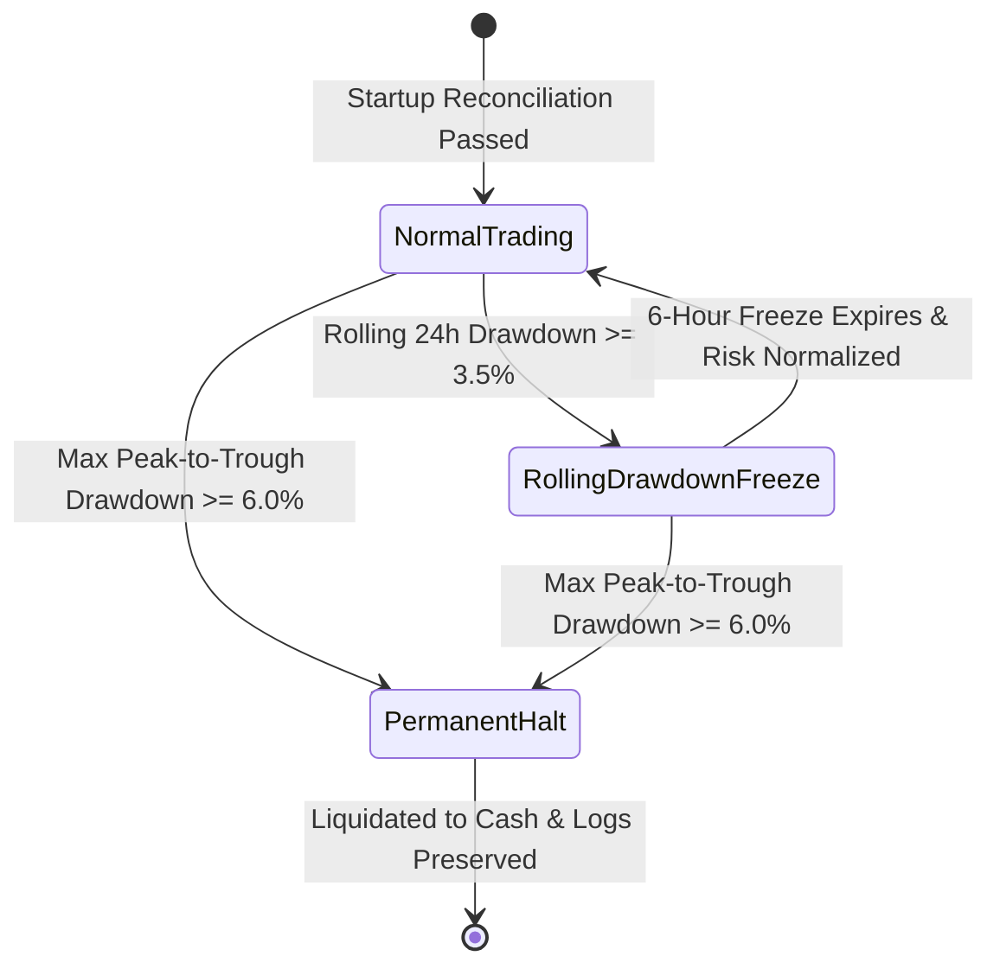

# RISK MANAGEMENT SPECIFICATION

This document outlines the mathematical risk management architecture, position sizing equations, portfolio exposure limits, capital preservation rules, and automated circuit breakers enforced by the bot.

---

## 1. Core Risk Principles

1. **Principle 5 — Risk Manager Has Veto Authority**: Any trading signal generated by a strategy must pass all risk gates. The Risk Manager can unilaterally reject any candidate trade without appeal.
2. **Capital Preservation Over Yield**: Maximum drawdown minimization is the primary architectural priority to maximize the official competition Composite Score ($0.4 \times Sortino + 0.3 \times Sharpe + 0.3 \times Calmar$).
3. **Spot-Only Discipline**: Strict enforcement of spot mechanics: zero leverage, zero borrowing, zero naked short positions.

---

## 2. Position Sizing Mathematical Model

Position sizing is dynamically calculated on every trade based on total portfolio equity and stop-loss distance:

### Step 1: Compute Risk Capital
$$\text{Risk Capital} = \text{Portfolio Equity} \times \text{Risk \%}$$
Where:
- $\text{Risk \%} = 1.0\%$ default (configurable up to a hard ceiling of $1.5\%$).
- $\text{Portfolio Equity} = \text{Free Cash} + \text{Locked Cash} + \sum (\text{Position Notional})$.

### Step 2: Compute Raw Quantity
$$\text{Stop Distance} = \text{Entry Price} - \text{Stop Loss Price}$$
$$\text{Raw Quantity} = \frac{\text{Risk Capital}}{\text{Stop Distance}}$$

### Step 3: Enforce Capital Constraints
The sized quantity is sequentially restricted by three hard capital ceilings:

1. **Available Cash Ceiling (Mandatory 5% Cash Reserve)**:
   $$\text{Available Cash} = \max(0, \text{Cash} - (\text{Portfolio Equity} \times 0.05))$$
   $$\text{Max Qty}_{\text{cash}} = \frac{\text{Available Cash}}{\text{Entry Price}}$$
   $$\text{Quantity} = \min(\text{Quantity}, \text{Max Qty}_{\text{cash}})$$

2. **Gross Exposure Ceiling (100% Equity / No Leverage)**:
   $$\text{Max Gross Exposure} = \text{Portfolio Equity} \times 1.00$$
   $$\text{Remaining Exposure} = \max(0, \text{Max Gross Exposure} - \text{Current Portfolio Position Notional})$$
   $$\text{Max Qty}_{\text{exposure}} = \frac{\text{Remaining Exposure}}{\text{Entry Price}}$$
   $$\text{Quantity} = \min(\text{Quantity}, \text{Max Qty}_{\text{exposure}})$$

3. **Single-Asset Concentration Cap (50% Equity)**:
   $$\text{Max Single Notional} = \text{Portfolio Equity} \times 0.50$$
   $$\text{Quantity} = \min\left(\text{Quantity}, \frac{\text{Max Single Notional}}{\text{Entry Price}}\right)$$

### Step 4: Exchange Precision Alignment
The quantity is truncated down to the pair's official `AmountPrecision` retrieved from Roostoo `ExchangeInfo`:
$$\text{Final Quantity} = \frac{\lfloor \text{Quantity} \times 10^{\text{precision}} \rfloor}{10^{\text{precision}}}$$

If $\text{Final Quantity} \times \text{Entry Price} < \text{MiniOrder}$ (default \$1.00 USD), the trade is rejected.

---

## 3. Automated Drawdown Circuit Breakers

The bot maintains real-time tracking of portfolio peak equity and rolling 24-hour equity snapshots to enforce two multi-tiered circuit breakers:

### 3.1 Rolling 24-Hour Drawdown Breaker (3.5% Threshold)
- **Calculation**:
  $$\text{Peak}_{24h} = \max_{t \in [now - 24h, now]} (\text{Equity}_t)$$
  $$\text{Rolling Drawdown} = \frac{\text{Peak}_{24h} - \text{Current Equity}}{\text{Peak}_{24h}}$$
- **Automated Actions when Rolling Drawdown $\ge 3.5\%$**:
  1. Liquidate/close all open positions to cash immediately.
  2. Cancel all outstanding pending orders on the exchange.
  3. Freeze all new trade entries for exactly **6 hours**.
  4. Log critical circuit-breaker event to the SHA-256 audit chain.
  5. Resume trading automatically only when the 6-hour freeze expires and market conditions normalize.

### 3.2 Maximum Drawdown Breaker (6.0% Threshold)
- **Calculation**:
  $$\text{Historical Peak} = \max_{t \in [0, now]} (\text{Equity}_t)$$
  $$\text{Maximum Drawdown} = \frac{\text{Historical Peak} - \text{Current Equity}}{\text{Historical Peak}}$$
- **Automated Actions when Maximum Drawdown $\ge 6.0\%$**:
  1. Immediately liquidate all active positions to cash via market orders.
  2. Cancel all active orders on the exchange.
  3. Permanently trip `permanent_kill_switch = True`, disabling all new order placements for the remainder of the competition run.
  4. Flush and persist all local ledger files, order states, and cryptographic audit records.

---

## 4. Trailing Stop Engine

Positions are monitored on every market tick to dynamically ratchet stop-losses:

1. **Initial Stop**: Hard stop placed at entry based on sweep wick or ATR buffer.
2. **Breakeven Threshold (+1.0R Profit)**:
   When profit reaches $+1.0R$ ($\text{Current Price} \ge \text{Entry} + 1.0 \times \text{Stop Distance}$), the stop loss is automatically ratcheted to:
   $$\text{New Stop} = \max(\text{Current Stop}, \text{Entry Price} \times 1.0015)$$
   This guarantees that trading fees (0.10% taker entry + 0.05% maker exit) are protected.
3. **Trailing Activation (+2.0R Profit)**:
   When profit reaches $+2.0R$, trailing stop activates based on ATR:
   $$\text{New Stop} = \max(\text{Current Stop}, \text{Highest Price} - 1.50 \times ATR_{14})$$
4. **Ratchet Guarantee**: Stops are strictly monotonic—they can only move closer to current market price, never farther away.
